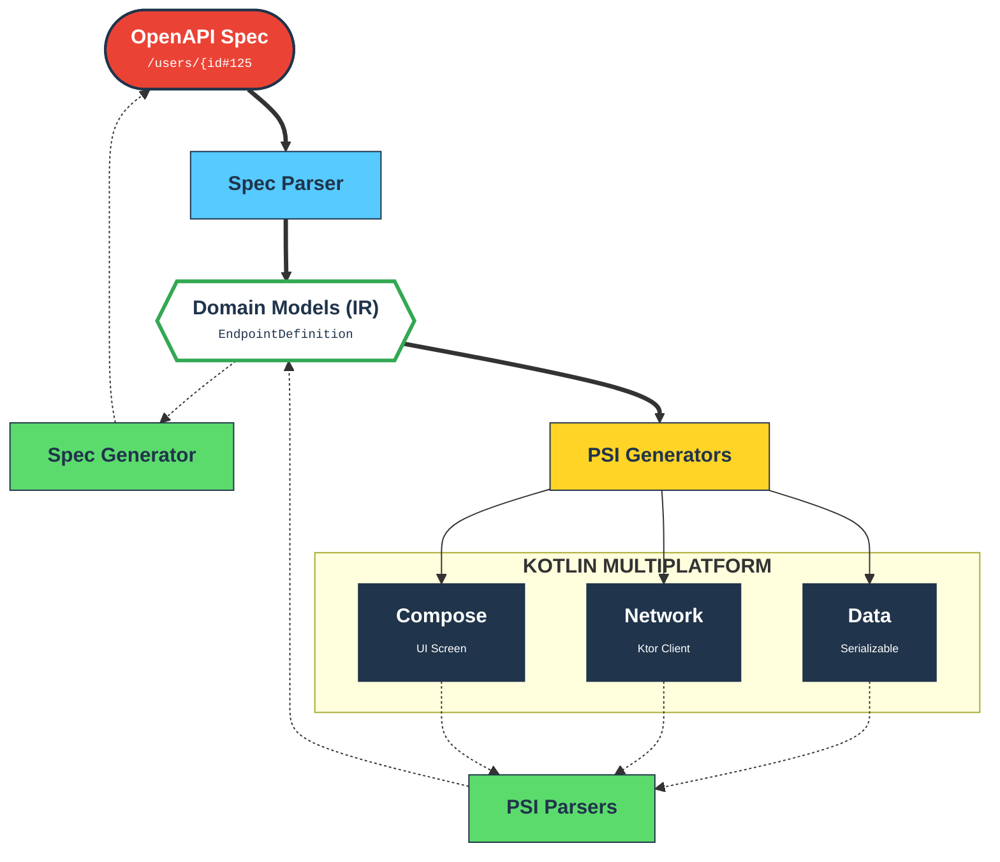

# cdd-kotlin Architecture

<!-- BADGES_START -->
<!-- Replace these placeholders with your repository-specific badges -->

<!-- BADGES_END -->

The project is built around the `kotlin-compiler-embeddable` artifact to manipulate source code programmatically. It acts as a dedicated compiler and transpiler. Its fundamental architecture follows standard compiler design principles, divided into three distinct phases: **Frontend (Parsing)**, **Intermediate Representation (IR)**, and **Backend (Emitting)**.

This decoupled design ensures that any format capable of being parsed into the IR can subsequently be emitted into any supported output format, whether that is a server-side route, a client-side SDK, a database ORM, or an OpenAPI specification.

## 🏗 High-Level Overview

## 🧩 Core Components

### 1. The Frontend (Parsers)

The Frontend's responsibility is to read an input source and translate it into the universal CDD Intermediate Representation (IR).

* **Static Analysis (AST-Driven)**: For `Kotlin` source code, the tool **does not** use dynamic reflection or execute the code. Instead, it reads the source files, generates an Abstract Syntax Tree (AST), and navigates the tree to extract classes, structs, functions, type signatures, API client definitions, server routes, and docstrings.
* **OpenAPI Parsing**: For OpenAPI and JSON Schema inputs, the parser normalizes the structure, resolving internal `$ref`s and extracting properties, endpoints (client or server perspectives), and metadata into the IR.

### 2. Intermediate Representation (IR)

The Intermediate Representation is the crucial "glue" of the architecture. It is a normalized, language-agnostic data structure that represents concepts like:
* **Models**: Entities containing typed properties, required fields, defaults, and descriptions.
* **Endpoints / Operations**: HTTP verbs, paths, path/query/body parameters, and responses. In the IR, an operation is an abstract concept that can represent *either* a Server Route receiving a request *or* an API Client dispatching a request.
* **Metadata**: Tooling hints, docstrings, and validations.

By standardizing on a single IR (heavily inspired by OpenAPI / JSON Schema primitives), the system guarantees that parsing logic and emitting logic remain completely decoupled.

### 3. The Backend (Emitters)

The Backend's responsibility is to take the universal IR and generate valid target output. Emitters can be written to support various environments (e.g., Client vs Server, Web vs CLI).

* **Code Generation**: Emitters iterate over the IR and generate idiomatic `Kotlin` source code. 
  * A **Server Emitter** creates routing controllers and request-validation logic.
  * A **Client Emitter** creates API wrappers, fetch functions, and response-parsing logic.
* **Database & CLI Generation**: Emitters can also target ORM models or command-line parsers by mapping IR properties to database columns or CLI arguments.
* **Specification Generation**: Emitters translating back to OpenAPI serialize the IR into standard OpenAPI 3.x JSON or YAML, rigorously formatting descriptions, type constraints, and endpoint schemas based on what was parsed from the source code.

## 🔄 Extensibility

Because of the IR-centric design, adding support for a new `Kotlin` framework (e.g., a new Client library, Web framework, or ORM) requires minimal effort:
1. **To support parsing a new framework**: Write a parser that converts the framework's AST/DSL into the CDD IR. Once written, the framework can automatically be exported to OpenAPI, Client SDKs, CLI parsers, or any other existing output target.
2. **To support emitting a new framework**: Write an emitter that converts the CDD IR into the framework's DSL/AST. Once written, the framework can automatically be generated from OpenAPI or any other supported input.

## Supported Mappings

### Types

The `TypeMappers` ensure correct conversion between abstract types and Kotlin specific implementations.

| Abstract  | Format  | Kotlin type              |
|-----------|---------|--------------------------|
| `string`  | -       | `String`                 |
| `integer` | `int32` | `Int`                    |
| `integer` | `int64` | `Long`                   |
| `number`  | -       | `Double`                 |
| `boolean` | -       | `Boolean`                |
| `array`   | -       | `List<T>`                |
| `object`  | -       | `Data Class` (Reference) |
| `object`  | `additionalProperties` | `Map<String, T>` |

Top-level primitive and array schemas are generated as Kotlin `typealias` declarations (and parsed back), preserving formats such as `date-time` and array item types. `$ref` and `$dynamicRef` in Schema Objects resolve to Kotlin type names during code generation. When a Schema Object omits `type`, the generator infers a Kotlin type from JSON Schema keywords (e.g., `properties` -> object, `items` -> array, numeric/string constraints -> number/string) to preserve strong typing.

## 🛡 Design Principles

1. **A Single Source of Truth**: Developers should be able to maintain their definitions in whichever format is most ergonomic for their team (OpenAPI files, Native Code, Client libraries, ORM models) and generate the rest.
2. **Zero-Execution Parsing**: Ensure security and resilience by strictly statically analyzing inputs. The compiler must never need to run the target code to understand its structure.
3. **Lossless Conversion**: Maximize the retention of metadata (e.g., type annotations, docstrings, default values, validators) during the transition `Source -> IR -> Target`.
4. **Symmetric Operations**: An Endpoint in the IR holds all the information necessary to generate both the Server-side controller that fulfills it, and the Client-side SDK method that calls it.