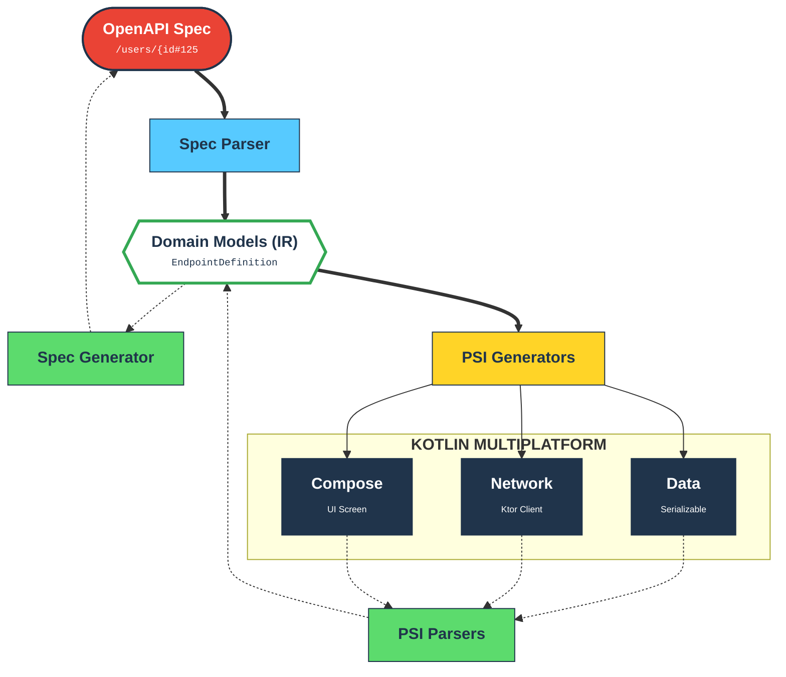

cdd-kotlin
==========

[](LICENSE-APACHE)
[](https://kotlinlang.org)
[](https://www.jetbrains.com/lp/compose-multiplatform/)
[](https://ktor.io/)
[](https://github.com/offscale/cdd-kotlin/actions/workflows/ci.yml)

**OpenAPI ↔ Kotlin Multiplatform**

`cdd-kotlin` is a bidirectional, distinct-framework code generator and analysis tool designed for the modern Kotlin
Multiplatform (KMP) ecosystem. It leverages the **Kotlin Compiler PSI (Program Structure Interface)** to not only
generate robust scaffolding, network layers, and UI components but also to **reverse-engineer** existing code back into
abstract specifications.

It bridges the gap between API contracts and full-stack KMP applications targeting: Android, iOS, Desktop, and web.

## Key Features

This tool goes beyond simple template expansion by treating Kotlin source code as a queryable, editable syntax tree.

### 🏗️ Intelligent KMP Scaffolding

Bootstrapping a Multiplatform project is notoriously complex. `cdd-kotlin` automates the generation of a
production-ready infrastructure:

- **Gradle Version Catalogs:** Generates `libs.versions.toml` managing dependencies for Ktor, Compose, and Coroutines.
- **Target Configuration:** auto-configures `androidMain`, `iosMain`, and `desktopMain` source sets.
- **Manifests & Gradle Scripts:** Outputs valid `build.gradle.kts` files and `AndroidManifest.xml`.

### 🔄 Bidirectional Round-Trip Engineering

Reliability is ensured through "Round-Trip" verification. If the tool generates code from a spec, it can parse that code
back into the exact same spec.

- **Generator:** Transforms abstract Schema/Endpoint definitions into `@Serializable` DTOs and Ktor clients.
- **Parser:** Analyzes Kotlin AST to extract models and API definitions from existing source files.
- **Sealed interface polymorphism:** Infers `oneOf` and discriminator mappings from sealed subtypes, honoring `@SerialName` values during Kotlin → OpenAPI parsing.
- **Content selection:** When inferring Kotlin types from `content`, selects the most specific media type key, preferring JSON when equally specific.
- **Component $ref resolution:** Resolves component refs for parameters, responses, request bodies, headers, links, examples, media types, callbacks, and path items (including absolute or relative URI refs that contain `#/components/...`), while preserving the original `$ref` for round-trip fidelity. Component-to-component `$ref` entries inside `components.*` are also resolved for codegen without losing the original `$ref`.
- **Dynamic $dynamicRef resolution:** Resolves `$dynamicRef` targets using `$dynamicAnchor` scopes for schema selection during codegen and validation.
- **RequestBody content presence:** Preserves missing vs explicit-empty `requestBody.content` to keep invalid-but-real-world inputs round-trippable.
- **Boolean schema components:** Emits `true`/`false` schema definitions without requiring a dummy `type`, matching JSON Schema 2020-12 behavior.
- **Path Item Refs:** Resolves `#/components/pathItems/*` when flattening paths for code generation.
- **External Path Item Refs:** Supports resolving external `#/components/pathItems/*` references via registry-backed resolvers.
- **OpenAPI → Kotlin metadata bridge:** `OpenApiDefinition.toMetadata()` preserves root metadata, path-level metadata, and non-schema components when generating Kotlin.
- **Merger:** Smartly injects new properties or endpoints into *existing* files without overwriting manual logic or
  comments (uses PSI text range manipulation).

### 📱 Full-Stack Generation

`cdd-kotlin` covers the entire application layer:

- **Data Layer:** Generates Kotlin Data Classes with `kotlinx.serialization` and KDoc support.
- **Network Layer:** Generates strict `Ktor` interfaces, implementations, exception handling, and parameter
  serialization (Path, Query, Querystring, Header, Cookie, Body).
  - **Query serialization styles:** Supports `form` (explode true/false), `spaceDelimited`, `pipeDelimited`,
    and `deepObject` for array/object query parameters.
  - **Query flags:** Honors `allowReserved` and `allowEmptyValue` when generating client query serialization.
  - **Path/Header/Cookie serialization:** Supports path `matrix`/`label`/`simple` and header/cookie array/object
    expansion (including `cookie` style).
  - **Path percent-encoding:** Encodes path parameter values per RFC3986 rules (with `allowReserved` support) and
    supports `content`-based path parameters by serializing the media type before encoding.
  - **Parameter schema/content:** Preserves full Parameter Object `schema`/`content` via `@paramSchema` and
    `@paramContent` KDoc tags for round-trip parsing.
  - **Parameter content serialization:** Generates runtime serialization for `content` parameters
    (query/header/cookie), honoring media types and OAS constraints (no `style`/`explode`/`allowReserved`).
  - **Parameter references:** Preserves `$ref` parameters via `@paramRef` KDoc tags for round-trip parsing.
  - **Parameter examples:** `@paramExample` supports JSON Example Objects (e.g. `summary`, `dataValue`,
    `serializedValue`, `externalValue`) for richer round-trip fidelity.
  - **Parameter extensions:** Preserves Parameter Object `x-` extensions via `@paramExtensions` KDoc tags.
  - **Querystring content:** Encodes `in: querystring` parameters using `application/json` or
    `application/x-www-form-urlencoded` content into `url.encodedQuery`.
  - **Security metadata:** Preserves operation-level security requirements via KDoc tags for round-trip parsing.
  - **OAuth2/OpenID Connect flows:** Generates PKCE helpers, auth URL builders, token exchange/refresh/device-flow scaffolding, and bearer-token hooks for `oauth2` and `openIdConnect` schemes.
  - **Mutual TLS (mTLS):** Generates `MutualTlsConfig` plus a `MutualTlsConfigurer` hook for wiring client certificates in the HttpClient factory.
  - **Operation external docs:** Supports `@see` and `@externalDocs` (with extensions) for operation-level ExternalDocumentation.
  - **Operation servers:** Preserves per-operation server overrides via `@servers` KDoc tags for round-trip parsing.
  - **Operation server variables:** Resolves per-operation server templates using default variable values in generated client URLs.
  - **Request bodies:** Preserves requestBody description/required/content via `@requestBody` KDoc tags for round-trip parsing.
  - **Schema-less content:** When a media type omits `schema`/`itemSchema`, infers Kotlin types from the media type
    (`application/json` / `+json` → `Any`, text / `+xml` / `application/x-www-form-urlencoded` / `multipart/form-data`
    → `String`, other concrete media types → `ByteArray`).
  - **Request body serialization:** Generates Ktor encoders for `application/x-www-form-urlencoded` and
    `multipart/form-data` (honors per-property `encoding.contentType`, `encoding.style`, `encoding.explode`,
    and `encoding.allowReserved` when provided).
  - **Positional multipart encoding:** Generates multipart bodies from `prefixEncoding` / `itemEncoding` for
    `multipart/*` media types that use positional parts (e.g. `multipart/mixed`).
  - **Multipart encoding headers:** Emits per-part headers from `encoding.headers` when string example/default values are present
    (skips `Content-Type`, which is controlled by `encoding.contentType`).
  - **Default server URL:** When no `servers` are defined, generated clients default `baseUrl` to `/` per OAS.
  - **Wildcard media types:** Avoids emitting a concrete `Content-Type` header for wildcard ranges like `text/*`.
  - **Sequential media types:** When `itemSchema` is used without `schema`, inferred Kotlin types default to `List<T>`
    for request/response bodies to match the OAS sequential media type array model. JSON-sequential request/response
    bodies (`application/jsonl`, `application/x-ndjson`, `application/*+json-seq`) are serialized/deserialized as
    JSON Lines or JSON Text Sequences instead of JSON arrays.
  - **Callbacks:** Preserves operation-level callbacks via `@callbacks` KDoc tags for round-trip parsing.
  - **Response summaries:** Preserves Response Object `summary` via `@responseSummary` KDoc tags for round-trip parsing.
  - **Response references:** Preserves `$ref` responses via `@responseRef` KDoc tags for round-trip parsing.
  - **Response extensions:** Preserves Response Object `x-` extensions via `@responseExtensions` KDoc tags.
  - **Response headers:** Omits `Content-Type` response headers per OAS rules.
  - **Operation extensions:** Preserves Operation Object `x-` extensions via `@extensions` KDoc tags for round-trip parsing.
  - **OperationId omission:** Preserves missing `operationId` via `@operationIdOmitted` for round-trip fidelity.
  - **Root metadata:** Preserves OpenAPI root metadata via interface KDoc tags:
    `@openapi`, `@info`, `@servers`, `@security`, `@securityEmpty`, `@tags`, `@externalDocs`,
    `@extensions`, `@pathsExtensions`, `@pathsEmpty`, `@pathItems`, `@webhooks`, `@webhooksExtensions`,
    `@webhooksEmpty`, `@securitySchemes`, `@componentSchemas`,
    `@componentExamples`, `@componentLinks`, `@componentCallbacks`,
    `@componentParameters`, `@componentResponses`, `@componentRequestBodies`, `@componentHeaders`,
    `@componentPathItems`, `@componentMediaTypes`, and `@componentsExtensions`.
  - **Server Variables & Server Selection:** Emits typed helpers to resolve templated server URLs, select named servers, and override defaults. Server variable enums generate Kotlin enums for stronger typing.
- **UI Layer (Jetpack Compose):** unique support for generating UI components based on data models:
    - **Forms:** Auto-generates Composable forms with state management, input validation, and object reconstruction.
    - **Grids:** Generates sortable data grids/tables.
    - **Screens:** Generates full screens that connect the Network layer to the UI layer with loading/error states.

## Architecture

The project is built around the `kotlin-compiler-embeddable` artifact to manipulate source code programmatically.



## Supported Mappings

### Types

The `TypeMappers` ensure correct conversion between abstract types and Kotlin specific implementations.

| Abstract  | Format  | Kotlin type              |
|-----------|---------|--------------------------|
| `string`  | -       | `String`                 |
| `integer` | `int32` | `Int`                    |
| `integer` | `int64` | `Long`                   |
| `number`  | -       | `Double`                 |
| `boolean` | -       | `Boolean`                |
| `array`   | -       | `List<T>`                |
| `object`  | -       | `Data Class` (Reference) |
| `object`  | `additionalProperties` | `Map<String, T>` |

Top-level primitive and array schemas are generated as Kotlin `typealias` declarations (and parsed back),
preserving formats such as `date-time` and array item types.
`$ref` and `$dynamicRef` in Schema Objects resolve to Kotlin type names during code generation.
When a Schema Object omits `type`, the generator infers a Kotlin type from JSON Schema keywords
(e.g., `properties` -> object, `items` -> array, numeric/string constraints -> number/string) to
preserve strong typing.

### Schema Annotations (OAS 3.2)

The DTO layer round-trips JSON Schema annotation and selected structural keywords via KDoc tags and Kotlin annotations:

- `title`, `default`, `const`
- `enum` (including non-string values via `@enum` KDoc tags)
- `schemaId`, `schemaDialect`, `anchor`, `dynamicAnchor`, `dynamicRef`, `defs`
- `deprecated` (also emitted as `@Deprecated`)
- `readOnly`, `writeOnly`
- `contentMediaType`, `contentEncoding`
- `minContains`, `maxContains`, `contains`, `prefixItems`
- `discriminator`, `discriminatorMapping`, `discriminatorDefault`
- `xmlName`, `xmlNamespace`, `xmlPrefix`, `xmlNodeType`, `xmlAttribute`, `xmlWrapped`
- `comment`
- `patternProperties`, `propertyNames`
- `dependentRequired`, `dependentSchemas`
- `unevaluatedProperties`, `unevaluatedItems`
- `contentSchema`
- `oneOf`, `anyOf`, `allOf`, `not`, `if`, `then`, `else`
- `additionalProperties` (including `false`)
- `customKeywords` (arbitrary JSON Schema keywords via `@keywords {...}`)
- legacy `nullable` / `x-nullable` (OAS 3.0 / Swagger 2.0) normalized to `type: ["T","null"]`

OpenAPI parsing/writing also supports additional JSON Schema structural keywords in the IR:

- `$comment`
- `$dynamicRef`
- `$defs`
- `if` / `then` / `else`
- `patternProperties`, `propertyNames`
- `dependentRequired`, `dependentSchemas`
- `unevaluatedProperties`, `unevaluatedItems`
- `contentSchema`
- `additionalProperties: false`
- custom JSON Schema keywords (non-`x-`) preserved via `customKeywords`

OpenAPI 3.2 object handling also preserves:

- `style: cookie` for cookie parameters
- Non-string `enum` values in Schema Objects
- Response `headers`, `links`, and `content` maps via `@responseHeaders`, `@responseLinks`, and `@responseContent`
- Component `$ref` emissions derived from Kotlin types (e.g., `requestBodyType`, response `type`, schema compositions) use `$self` as the base when present
- Component `$ref` resolution is `$self`-aware: when `$self` is present, only refs whose base matches `$self` (or fragment-only refs) are resolved
- Reference Objects (`$ref`) for Parameter and Response objects via `@paramRef` and `@responseRef`
- Reference Objects (`$ref`) for Link and Example objects
- Reference Objects (`$ref`) for Callback objects
- Reference Objects (`$ref`) for Security Schemes
- Reference Objects (`$ref`) for Media Type objects (including summary/description overrides)
- Explicit empty `security: []` at root/operation to clear inherited security
- Explicit empty `paths: {}` and `webhooks: {}` to preserve ACL semantics (`@pathsEmpty`, `@webhooksEmpty`)
- Link `parameters` and `requestBody` with non-string JSON values
- Schema Object `externalDocs` and `discriminator` on nested properties
- Schema Object `$ref` siblings (JSON Schema 2020-12 behavior) on nested properties
- Path Item `$ref` siblings (summary/description/parameters/operations) for round-trip safety
- Component schemas with omitted `type` (re-emitted without forcing `type: object`)
- Specification Extensions (`x-...`) across OpenAPI objects
- Component Media Type `$ref` resolution for codegen (while preserving `$ref` for round-trip)
- JSON Pointer percent-decoding for `$ref` component keys (e.g. `#/components/responses/Ok%20Response`)
- Webhook flattening helpers via `OpenApiPathFlattener.flattenWebhooks` and `flattenAll`

### UI Generation

The `UiGenerator` maps data types to Compose components:

- **String** → `OutlinedTextField`
- **Integer/Number** → `OutlinedTextField` (with Number Keyboard)
- **Boolean** → `Checkbox` + `Row`
- **Lists** → `LazyColumn` (in Grids)

## Prerequisite

This project requires a JDK environment capable of running the Kotlin Compiler PSI.

- **JDK:** 17+
- **Kotlin:** 2.0+

## Usage

Currently, the tool acts as a library or a runner. The entry point is `src/main/kotlin/Main.kt`.

### Scaffolding a New Project

The `ScaffoldGenerator` builds a full project structure in the specified output directory.

```kotlin
fun main() {
    val generator = ScaffoldGenerator()
    val outputDir = File("my-kmp-app")

    generator.generate(
        outputDirectory = outputDir,
        projectName = "MyKmpApp",
        packageName = "com.example.app"
    )
}
```

### Generating Code Programmatically

You can generate specific layers using individual generators:

```kotlin
// 1. Define the Schema
val userSchema = SchemaDefinition(
    name = "User",
    type = "object",
    properties = mapOf(
        "username" to SchemaProperty("string"),
        "isActive" to SchemaProperty("boolean")
    )
)

// 2. Generate DTO
val dto = DtoGenerator().generateDto("com.app.model", userSchema)

// 3. Generate Compose Form
val form = UiGenerator().generateForm("com.app.ui", userSchema)
```

### Exporting OpenAPI (Kotlin -> OpenAPI)

You can assemble an OpenAPI document from Kotlin source parsing results and serialize it to JSON or YAML:

```kotlin
val schemas = DtoParser().parse(kotlinDtosSource)
val endpoints = NetworkParser().parse(ktorClientSource)

val definition = OpenApiAssembler().assemble(
    info = Info(title = "My API", version = "1.0.0"),
    schemas = schemas,
    endpoints = endpoints,
    servers = listOf(Server(url = "https://api.example.com")),
    extensions = mapOf("x-owner" to "core-team"),
    // Optional: lift shared path params/summary/description/servers into Path Items
    liftCommonPathMetadata = true
)

val json = OpenApiWriter().writeJson(definition)
val yaml = OpenApiWriter().writeYaml(definition)
```

### Schema Documents (OAS 3.2)

OpenAPI 3.2 allows standalone Schema Object documents (JSON Schema 2020-12) as OAD entries.
You can parse or write these directly:

```kotlin
// Parse any document into either OpenAPI or Schema
val doc = OpenApiParser().parseDocumentString("""{ "type": "string" }""")

// Provide a base URI when $self is missing so relative $ref values can be resolved
val docWithBase = OpenApiParser().parseDocumentString(
    source = """{ "openapi": "3.2.0", "info": { "title": "API", "version": "1.0" } }""",
    baseUri = "file:///apis/openapi.json"
)

// Parse a schema-only document (throws if it's an OpenAPI Object)
val schema = OpenApiParser().parseSchemaString("""{ "type": "string", "minLength": 2 }""")

// Write a standalone schema document
val jsonSchemaDoc = OpenApiWriter().writeSchema(schema)
```

### Multi-Document $ref Registry (No Network)

To resolve cross-document `$ref` values without network access, register additional documents in an
in-memory registry and pass it to the parser. Relative `$self`/`$id` values are resolved against the
provided `baseUri` for lookup:

```kotlin
val registry = OpenApiDocumentRegistry()

// Register shared components (indexed by $self and/or baseUri)
val shared = OpenApiParser().parseString(sharedJson)
registry.registerOpenApi(shared)

// Parse the main document with the registry
val main = OpenApiParser().parseString(mainJson, registry = registry)

// If refs are relative, provide a base URI when parsing and registering
val sharedBase = "https://example.com/root/shared/common.json"
registry.registerOpenApi(shared, baseUri = sharedBase)
val mainWithBase = OpenApiParser().parseString(
    mainJson,
    baseUri = "https://example.com/root/openapi.json",
    registry = registry
)
```

## Testing & Verification

The project contains a comprehensive test suite in `src/test/kotlin` split into three categories:

1. **PSI Tests (`psi/`):** Validates that generators produce valid Kotlin syntax and parsers correctly extract
   definitions from source code.
2. **Scaffold Tests (`scaffold/`):** Ensures all Gradle configurations, version catalogs, and directory structures are
   created correctly.
3. **Round-Trip Verification (`verification/RoundTripTest.kt`):**
    - **Process:** `Spec A` → `Generate Code` → `Parse Code` → `Spec B`.
    - **assertion:** `Spec A == Spec B`.
    - This ensures that no data is lost during the generation/parsing lifecycle.

Run tests via Gradle:

```bash
./gradlew test
```

### Compliance Validation (OAS 3.2)

Use the validator to catch common OpenAPI 3.2 structural violations:

```kotlin
val issues = OpenApiValidator().validate(definition)
if (issues.isNotEmpty()) {
    issues.forEach { println("${it.severity}: ${it.path} -> ${it.message}") }
}
```

Validator coverage includes:

- Path template + path parameter consistency (including duplicate template names)
- Path template collision detection across paths with equivalent templated structure
- Path keys must not include query strings or fragments
- OperationId uniqueness across paths, webhooks, callbacks, and component Path Items
- Response code format validation (`200`, `2XX`, `default`)
- Server variable enum/default consistency and url-variable usage rules
- Server variables defined but not used in the url (warning)
- URI/email format validation for Info/contact/license/externalDocs and OAuth/OpenID URL fields
- Security scheme type validation and `apiKey.in` location checks
- Response presence, required response descriptions, and header `Content-Type` restrictions
- Parameter/header schema/content rules and style/explode constraints
- OpenAPI version must be `3.2.x` (warning if not)
- `allowEmptyValue` is only valid for query parameters
- Header parameters named `Accept`, `Content-Type`, or `Authorization` are ignored (warning)
- Single-response operations should use a success (`2XX`) response (warning)
- Header `content` must not be combined with `style`/`explode`
- Header names (parameters/response/encoding) must be valid HTTP tokens
- Path Item parameter uniqueness and parameter validation at the Path Item level
- Path Item `$ref` with sibling fields (warning)
- Sequential media type rules for `itemSchema` and positional encoding
- Parameters using `content` must not define `style`/`explode`/`allowReserved`
- Parameter and Header `content` must contain exactly one media type
- Media type keys must be valid media types or media type ranges
- Schema bound validation for min/max length/items/properties/contains (non-negative + ordering)
- Schema content metadata validation for `contentMediaType` and `contentEncoding`
- Schema dialect-aware warnings for OpenAPI-only keywords and custom keywords when `jsonSchemaDialect`/`$schema` target non-OAS vocabularies
- Server name uniqueness within a `servers` list (root/path/operation)
- `additionalOperations` method tokens must be valid HTTP tokens
- Webhook Path Items are validated without path-key constraints
- Encoding entries must match schema properties (encoding-by-name warnings)
- Encoding headers must not include `Content-Type` (warning)
- `$self` must be a valid URI reference
- Callback runtime expressions are validated for basic syntax (including embedded expressions in URLs)
- Security scheme component names that look like URIs are flagged (warning)
- Link runtime expressions in `parameters`/`requestBody` are validated for basic syntax
- Media Type and Example `$ref` with sibling fields or extensions are ignored (warning)
- Reference Object `$ref`, Schema `$ref`/`$dynamicRef`/`$id`/`$schema`, and Example `externalValue` are validated as URIs
- Local component `$ref` targets are validated for Parameters, Headers, RequestBodies, Responses, Links, Examples, MediaTypes, SecuritySchemes, and PathItems
- Schema `$ref` targets are validated for local component schemas and in-scope `$defs`
- Response `links` keys must match the component name regex
- Link `operationId` must reference an existing operationId
- Link `operationRef` must be a valid URI reference
- Link `operationRef` local JSON Pointers (including `$self`-based absolute refs) must resolve to an existing operation
- Link `operationRef` normalization accepts percent-encoded path template braces (`%7B` / `%7D`)
- Discriminator rules (composition required; defaultMapping required when discriminator property is optional)
- XML Object constraints (`nodeType` vs `attribute`/`wrapped`, and `wrapped` requires array schemas)

## License

Licensed under either of

- Apache License, Version 2.0 ([LICENSE-APACHE](LICENSE-APACHE) or <https://www.apache.org/licenses/LICENSE-2.0>)
- MIT license ([LICENSE-MIT](LICENSE-MIT) or <https://opensource.org/licenses/MIT>)

at your option.
